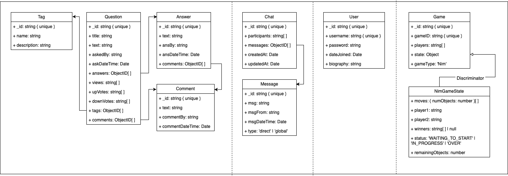

## My Contributions

During this group project, I worked primarily on the notification and messaging systems. Below are the features I contributed to:

### 🔔 Notification System

- **API Design**: Added several backend routes in [`server/controllers/notification.controller.ts`](server/controllers/notification.controller.ts) to support notification functionality:
  - `POST /addNotification` – create and store a new notification
  - `GET /getNotification/:notificationId` – fetch a specific notification
  - `GET /getNotisByUser/:username` – fetch all notifications for a user
  - `PATCH /markNotiRead/:notificationId` – mark a specific notification as read
  - `PATCH /markAllNotisRead/:username` – mark all notifications for a user as read

- **Notification Hook**: Created the original custom React hook in [`client/src/hooks/useNotifications.ts`](client/src/hooks/useNotifications.ts) to:
  - Fetch and display notifications for the current user.
  - Set up backend fetching and real-time updates using `notificationUpdate` (initially for new notifications only).
  - Sorting logic and the `handleNotiCreate` handler were added later by teammates (not necessary initially).

### ✅ Read Receipts in Messaging

Implemented read receipt functionality across multiple files:

- **Data Model Changes**:
  - [`server/utils/database.util.ts`](server/utils/database.util.ts)
  - [`shared/types/message.d.ts`](shared/types/message.d.ts)

- **Frontend Display**:
  - [`client/src/components/main/messageCard/index.tsx`](client/src/components/main/messageCard/index.tsx)

- **Socket Logic**:
  - [`client/src/hooks/useDirectMessage.ts`](client/src/hooks/useDirectMessage.ts)
  - [`server/controllers/chat.controller.ts`](server/controllers/chat.controller.ts)

- **Message Updates**:
  - [`server/controllers/message.controller.ts`](server/controllers/message.controller.ts)
  - [`client/src/services/messageService.ts`](client/src/services/messageService.ts)

Read receipts were implemented so that:
- Messages are marked as read when a user enters a chat.
- New messages are marked as read if the viewer is already in the chat.
- The `readBy` field tracks which users have seen a message.

These changes spanned both frontend and backend code, enhancing the messaging experience with real-time feedback and better user awareness. 😀

ORIGINAL README BELOW!:

[](https://classroom.github.com/a/fE-a_qEp)
The individual and team project for this class are designed to mirror the experiences of a software engineer joining a new development team: you will be “onboarded” to our codebase, make several individual contributions, and then form a team to propose, develop and implement new features. The codebase that we’ll be developing on is a Fake Stack Overflow project (let’s call it HuskyFlow). You will get an opportunity to work with the starter code which provides basic skeleton for the app and then additional features will be proposed and implemented by you! All implementation will take place in the TypeScript programming language, using React for the user interface.

## Getting Started

Run `npm install` in the root directory to install all dependencies for the `client`, `server`, and `shared` folders.

{ : .note } Refer to [IP1](https://neu-se.github.io/CS4530-Spring-2025/assignments/ip1) and [IP2](https://neu-se.github.io/CS4530-Spring-2025/assignments/ip2) for further instructions related to setting up MongoDB, setting environment variables, and running the client and server.

## Codebase Folder Structure

- `client`: Contains the frontend application code, responsible for the user interface and interacting with the backend. This directory includes all React components and related assets.
- `server`: Contains the backend application code, handling the logic, APIs, and database interactions. It serves requests from the client and processes data accordingly.
- `shared`: Contains all shared type definitions that are used by both the client and server. This helps maintain consistency and reduces duplication of code between the two folders. The type definitions are imported and shared within each folder's `types/types.ts` file.

## Database Architecture

The schemas for the database are documented in the directory `server/models/schema`.
A class diagram for the schema definition is shown below:



## API Routes

### `/answer`

| Endpoint   | Method | Description      |
| ---------- | ------ | ---------------- |
| /addAnswer | POST   | Add a new answer |

### `/comment`

| Endpoint    | Method | Description       |
| ----------- | ------ | ----------------- |
| /addComment | POST   | Add a new comment |

### `/messaging`

| Endpoint     | Method | Description           |
| ------------ | ------ | --------------------- |
| /addMessage  | POST   | Add a new message     |
| /getMessages | GET    | Retrieve all messages |

### `/question`

| Endpoint          | Method | Description                     |
| ----------------- | ------ | ------------------------------- |
| /getQuestion      | GET    | Fetch questions by filter       |
| /getQuestionById/ | GET    | Fetch a specific question by ID |
| /addQuestion      | POST   | Add a new question              |
| /upvoteQuestion   | POST   | Upvote a question               |
| /downvoteQuestion | POST   | Downvote a question             |

### `/tag`

| Endpoint                   | Method | Description                                   |
| -------------------------- | ------ | --------------------------------------------- |
| /getTagsWithQuestionNumber | GET    | Fetch tags along with the number of questions |
| /getTagByName/             | GET    | Fetch a specific tag by name                  |

### `/user`

| Endpoint         | Method | Description                    |
| ---------------- | ------ | ------------------------------ |
| /signup          | POST   | Create a new user account      |
| /login           | POST   | Log in as a user               |
| /resetPassword   | PATCH  | Reset user password            |
| /getUser/        | GET    | Fetch user details by username |
| /getUsers        | GET    | Fetch all users                |
| /deleteUser/     | DELETE | Delete a user by username      |
| /updateBiography | PATCH  | Update user biography          |

### `/chat`

| Endpoint                    | Method | Description                                                                 |
| --------------------------- | ------ | --------------------------------------------------------------------------- |
| `/createChat`               | POST   | Create a new chat.                                                          |
| `/:chatId/addMessage`       | POST   | Add a new message to an existing chat.                                      |
| `/:chatId`                  | GET    | Retrieve a chat by its ID, optionally populating participants and messages. |
| `/:chatId/addParticipant`   | POST   | Add a new participant to an existing chat.                                  |
| `/getChatsByUser/:username` | GET    | Retrieve all chats for a specific user based on their username.             |

### `/games`

| Endpoint | Method | Description           |
| -------- | ------ | --------------------- |
| /create  | POST   | Create a new game     |
| /join    | POST   | Join an existing game |
| /leave   | POST   | Leave a game          |
| /games   | GET    | Retrieve all games    |

## Running Stryker Mutation Testing

Mutation testing helps you measure the effectiveness of your tests by introducing small changes (mutations) to your code and checking if your tests catch them. To run mutation testing with Stryker, use the following command in `server/`:

```sh
npm run stryker
```

{ : .note } In case you face an "out of memory" error while running Stryker, use the following command to increase the memory allocation to 4GB for Node.js:

```sh
node --max-old-space-size=4096 ./node_modules/.bin/stryker run
```
